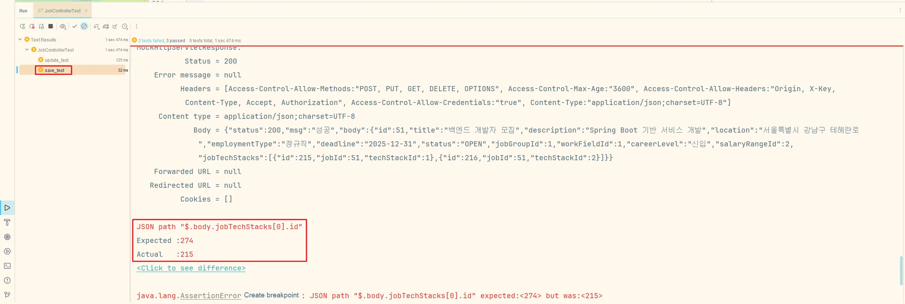
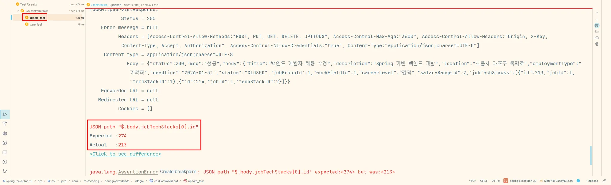
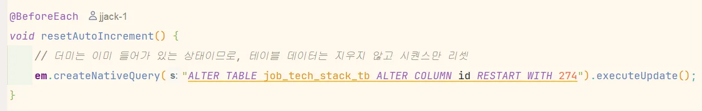
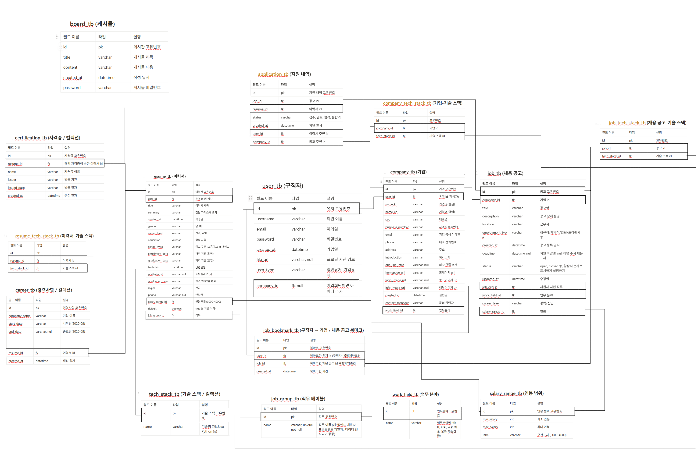

# Spring Boot 기반 구인구직 플랫폼 → RESTful 자원 서버로 전환

<h2>RocketDan</h2>

> 기존에 웹 화면 중심으로 구현된 ‘Spring Boot 기반 구인구직 플랫폼’을 프론트엔드-백엔드 완전 분리 구조의 RESTful API 서버로 재구성한 프로젝트입니다.
> Spring REST Docs를 통해 API 문서를 자동 생성하여, API 명세 관리와 유지보수 효율성을 높였으며, JWT 기반 인증, 예외 처리 구조 고도화, 테스트 기반 개발까지 적용하여 실제 서비스 수준의
> 백엔드 아키텍처 설계 및 구현 경험을 목표로 삼았습니다.

## 프로젝트 시연영상

<video src="https://github.com/user-attachments/assets/1b2f0507-0636-4f16-a0e2-48709d407600" controls width="600"></video>

## 목차

1. [🗓️ 개발 기간 및 참여 인원](#개발기간및참여인원)
2. [🔚 회고](#회고)
3. [📄 API 문서](#API문서)
4. [💡 주요 기능](#주요기능)
5. [✍️ 개인 기여도 및 역할](#개인기여도)
6. [👥 팀원](#팀원)
7. [🛠️ 기술 스택](#기술스택)
8. [🧩 문제 해결 경험](#문제해결경험)
9. [📋 ERD](#erd)

## 🗓️ 개발 기간 및 참여 인원

- 기간: 2025.05.12 ~ 2025.05.22
- 인원: 5인 팀 프로젝트

## 🔚 회고

**1️⃣ 협업 규칙을 지키는 것의 어려움**

두 번째 프로젝트는 첫 번째보다 익숙해졌기에 상대적으로 수월할 것이라 예상했지만, 막상 진행해보니 **데이터만 주고받는 구조임에도 불구하고 예상 외의 어려움이 많았습니다.**
특히 **JSON 기반으로 요청과 응답을 정확하게 주고받는 과정에서 세밀한 조율의 중요성**을 느꼈고, 팀 내에서 정의한 컨벤션을 **끝까지 일관되게 지키는 것이 얼마나 어려운 일인지** 다시금 절감하게 되었습니다.
이번 경험을 통해 협업은 단순한 역할 분담이 아니라 **약속을 지키고, 서로를 배려하며 맞춰가는 과정**이라는 사실을 깨달았습니다. 마지막 프로젝트에서는 더 나은 협업자이자 개발자로 성장할 수 있도록 **끝까지
책임감 있게 임하겠습니다.**

## 📄 API 문서

[//]: # (![api1]&#40;docs/images/api1.png&#41;)

[//]: # (![api2]&#40;docs/images/api2.png&#41;)

[//]: # (![api3]&#40;docs/images/api3.png&#41;)

## 💡 주요 기능

### 👤 개인

- 회원가입 / 로그인 / 로그아웃 / 회원정보 수정 (REST API 설계 및 문서화)
- 채용공고 상세 조회 및 이력서 지원 API
- 이력서 등록 / 수정 / 삭제 API
- 지원 내역 / 스크랩 공고 마이페이지 API
- 합불 여부 결과 확인 API

### 🏢 기업

- 회원가입 / 로그인 / 로그아웃 / 기업 정보 수정 API
- 채용공고 등록 / 수정 / 조회 API
- 지원자 이력서 열람 / 스크랩 / 합격 여부 처리 API

## ✍️ 개인 기여도 및 역할

| 구분   | 기능명           | 설명                                                                                      |
|------|---------------|-----------------------------------------------------------------------------------------|
| (공통) | 회원 정보         | 회원 정보에 대한 상세보기(READ), 등록(CREATE), 수정(UPDATE) 기능 구현. 응답 DTO 설계 및 매핑                      |
| (기업) | 기업 회원의 공고 정보  | 기업이 작성한 공고 정보에 대해 상세보기(READ), 등록(CREATE), 수정(UPDATE) 기능 구현. 응답 DTO 설계 및 맵핑              |
| (개인) | 개인 회원의 공고 북마크 | 공고에 대한 북마크를 상세보기(READ), 등록(CREATE), 삭제(DELETE) 기능 구현. 응답 DTO 설계 및 맵핑                    |
| (개인) | 개인 회원의 이력서 정보 | 개인이 작성한 이력서 정보에 대해 상세보기(READ), 작성(CREATE), 수정(UPDATE), 삭제(DELETE) 기능 구현. 응답 DTO 설계 및 맵핑 |
| (개인) | 개인 회원의 공고 지원  | 개인이 공고에 지원하는 것에 대해 상세보기(READ), 등록(CREATE). 응답 DTO 설게 및 맵핑                               |

# 👥 팀 멤버

| 이름  | 역할 | GitHub                                       |
|-----|----|----------------------------------------------|
| 최재원 | 팀장 | [@jjack-1](https://github.com/jjack-1)       |
| 김건우 | 팀원 | [@GUNWO0](https://github.com/GUNWO0)         |
| 김세리 | 팀원 | [@roni243](https://github.com/roni243)       |
| 이연호 | 팀원 | [@yh88888888](https://github.com/yh88888888) |
| 조하은 | 팀원 | [@TaengGyul](https://github.com/TaengGyul)   |

# ⚙️ 기술 스택

## 🛠️ 사용 기술

<table>
  <tr>
    <td align="center"> Java</td>
    <td align="center"> Spring Boot</td>
    <td align="center"> H2</td>
    <td align="center"> Spring REST Docs</td>
    <td align="center"> JWT</td>
  </tr>
</table>

## 🧰 개발 환경

<table>
    <tr>
        <td align="center"> IntelliJ</td>
    </tr>
</table>

## 🤝 협업 도구

<table>
    <tr>
        <td align="center"> Git</td>
        <td align="center"> GitHub</td>
        <td align="center"> Notion</td>
        <td align="center"> Slack</td>
    </tr>
</table>

## 🧩 문제 해결 경험

### 💬 문제 : 통합 테스트 시 테이블 id 자동 생성 문제

**[공고 등록]**

**[공고 수정]**

- **문제 상황**
    - h2 db 에 더미를 넣어 놓은 상태에서 공고 등록 테스트, 공고 수정 테스트를 각각 진행하면 문제가 없었다
    - 공고에 대한 모든 컨트롤러 테스트를 만들고 **통합으로 실행**을 했을 때, **ID 자동 증가(Auto Increment) 문제**가 발생했다
- **원인 분석**
    - 공고를 등록하거나 수정할 때 공고의 기술 스택 목록을 전부 삭제하고 다시 등록을 하는데 공고 기술 스택 테이블의 **자동 증가가 롤백 되지 않아서 문제**가 생겼다
    - 공고 기술 스택 테이블은 계속 삭제되고 생성되는 과정을 반복하는데 **id 자동 증가 시퀀스**가 초기화 되지 않고 다음 테스트 진행에도 영향을 미친 것 같다
- **해결 방법**:
    - 테스트 진행 전에 id 자동 증가 시퀀스를 고정하는 방법을 사용하였다
      
    - 새로 생성될 때 항상 고정된 id 시퀀스로 시작되기 때문에 문제가 해결되었다
    - 다음 해결 방법은
        - @DirtiesContext(classMode = DirtiesContext.ClassMode.BEFORE_EACH_TEST_METHOD) 를 사용하는 것이다
        - **각 테스트 메서드가 실행되기 전에** 스프링 애플리케이션 컨텍스트를 다시 로드한다
        - data.sql의 더미 데이터가 처음부터 다시 로드되고, 시퀀스 값도 초기 상태로 완벽하게 리셋 하기 때문에 매번 테스트를 진행할 때 db 를 독립적으로 초기화 할 수 있다
    - 두 방법 중에서 시퀀스 고정을 사용한 이유는 더미 데이터와 로직 진행이 어떻게 되는지 알고 있는 상황에선 매번 테스트마다 컨텍스트를 초기화 약간 오래 걸리는 작업을 하지 않아도 테스트가 잘 되었다는 것을
      알 수 있기 때문이다
    - 만약 더미 데이터와 로직을 잘 모른다면 컨텍스트를 초기화 하는 방법이 더 좋을 수 있다

## 📋 ERD

